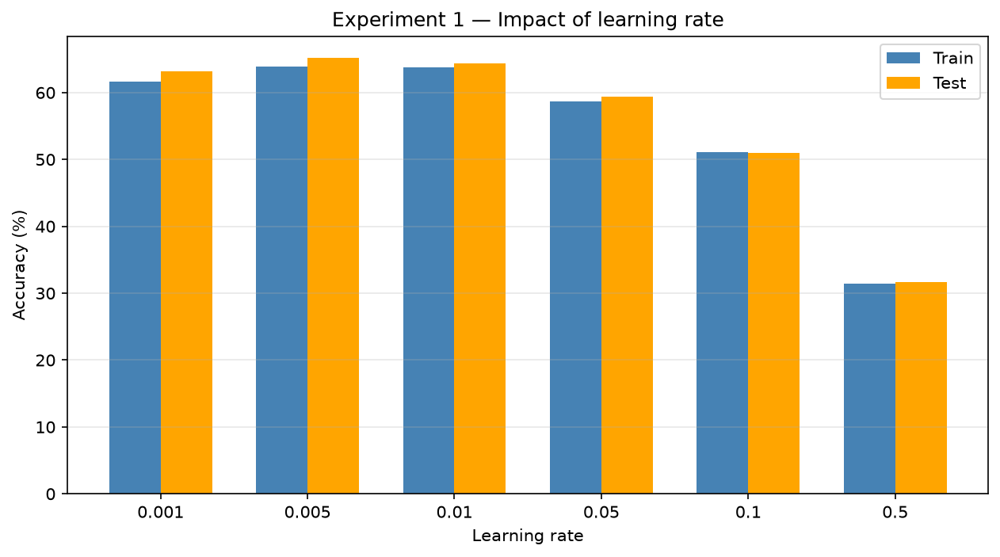
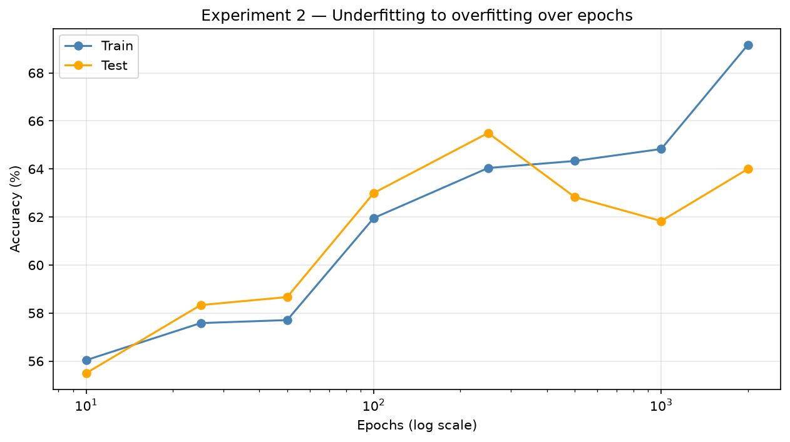
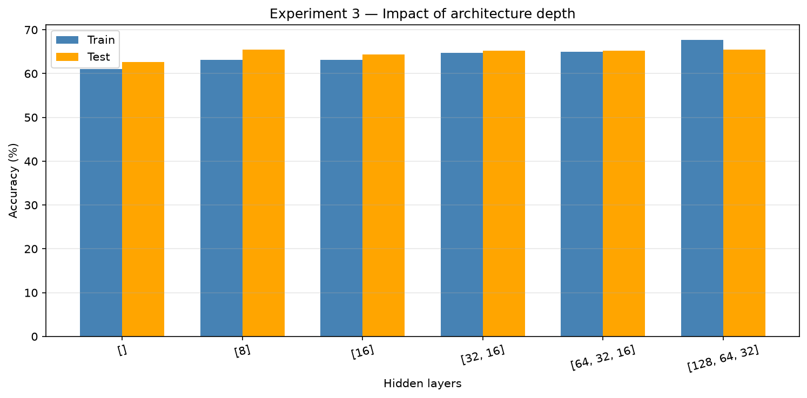
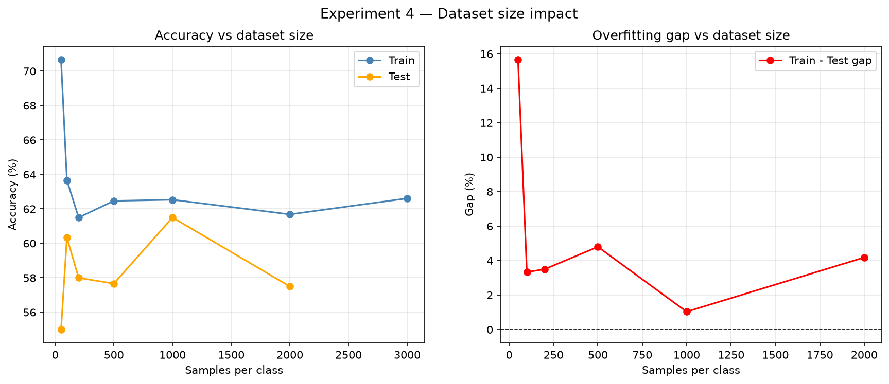
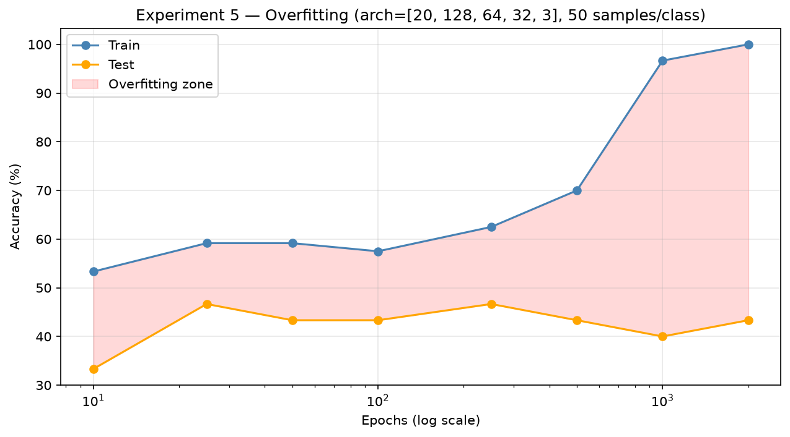
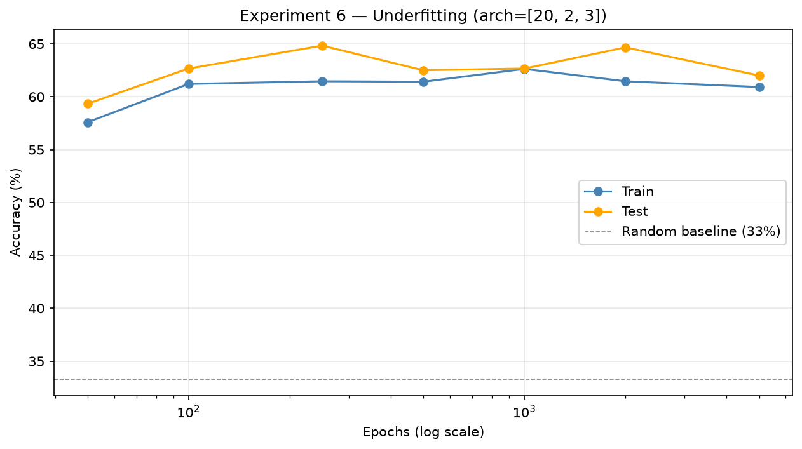
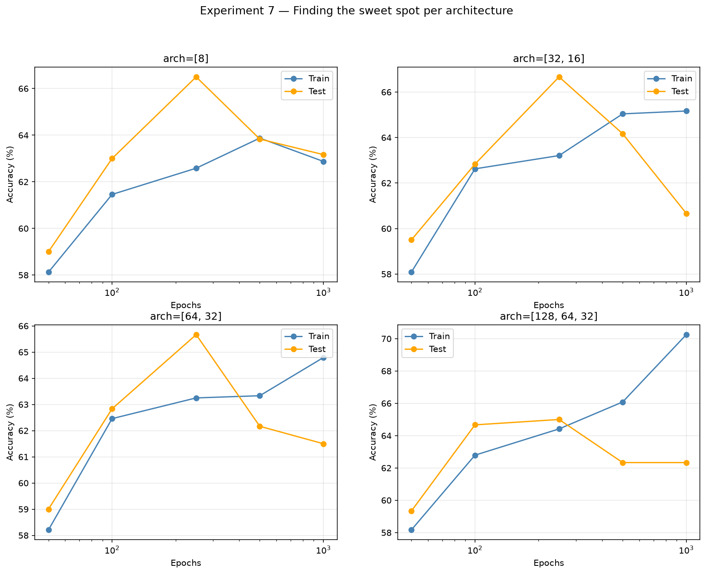
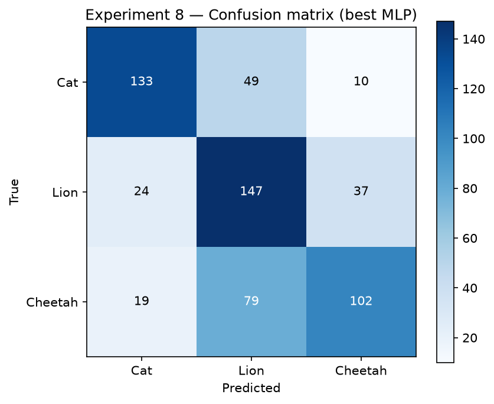

# Étude expérimentale du Perceptron Multi-Couches

## Cadre méthodologique

Dans cette partie, nous étudions le comportement de notre implémentation du Perceptron Multi-Couches sur le jeu de données felidae, qui regroupe des images de chats, de lions et de guépards. Chaque image est d'abord réduite à une taille de 32×32 pixels puis transformée en un vecteur de vingt caractéristiques par notre fonction d'extraction. Ces vingt caractéristiques regroupent la moyenne et l'écart-type de chaque canal de couleur, un histogramme de luminosité à huit intervalles, et une mesure de densité de contours à deux seuils. Ce choix de représentation compacte, plutôt qu'un aplatissement brut des pixels, respecte la contrainte que nous nous sommes fixée de ne jamais dépasser un nombre de caractéristiques supérieur à dix pour cent de la taille du jeu d'apprentissage.

Toutes les expériences qui suivent isolent un seul paramètre à la fois, de manière à mettre en évidence son influence propre sur la vitesse de convergence et sur la capacité de généralisation du modèle. Sauf mention contraire, nous utilisons une architecture de référence à deux couches cachées de trente-deux et seize neurones, un taux d'apprentissage de 0,01, et une fonction d'activation tangente hyperbolique. Le découpage entre apprentissage et test suit une répartition de quatre-vingts pour cent contre vingt pour cent. Chaque configuration a été journalisée dans TensorBoard afin de conserver la trace de la perte, de la précision d'apprentissage et de la précision de test à chaque époque.

## Expérience 1 — Influence du taux d'apprentissage

Nous avons d'abord fait varier le taux d'apprentissage sur six valeurs allant de 0,001 à 0,5, en gardant l'architecture et le nombre d'époques fixes à deux cents. Les résultats montrent une plage optimale étroite. Les meilleures précisions de test se situent autour de 0,005 et 0,01, avec environ soixante-cinq pour cent, tandis que les valeurs plus faibles convergent trop lentement pour atteindre leur plein potentiel en deux cents époques seulement.

Le phénomène le plus parlant apparaît du côté des taux élevés. À 0,1, la précision chute déjà à environ cinquante et un pour cent, et à 0,5 le réseau tombe à trente et un pour cent, c'est-à-dire en dessous du seuil aléatoire de trente-trois pour cent qu'obtiendrait un classifieur qui répondrait au hasard entre trois classes. Cette dégradation illustre l'instabilité des pas de gradient trop grands : les mises à jour de poids deviennent si importantes qu'elles font diverger l'apprentissage au lieu de le faire converger. Cette expérience justifie à elle seule pourquoi nous retenons un taux d'apprentissage modéré dans la suite du projet.

## Expérience 2 — Influence du nombre d'époques

Nous avons ensuite observé l'évolution des deux précisions en fonction du nombre d'époques, de dix jusqu'à deux mille. La courbe reproduit le comportement classique décrit en cours. Dans les premières époques, les deux précisions montent ensemble : le modèle est en situation de sous-apprentissage et progresse encore. La précision de test atteint son maximum, environ soixante-cinq et demi pour cent, autour de deux cent cinquante époques.

Au-delà de ce point, les deux courbes divergent. La précision d'apprentissage continue de croître régulièrement jusqu'à près de soixante-neuf pour cent, alors que la précision de test redescend et devient irrégulière. Cette divergence est la signature même du sur-apprentissage : le réseau se met à mémoriser les particularités du jeu d'apprentissage au lieu d'apprendre des régularités transférables. Le point situé autour de deux cent cinquante époques représente donc le compromis que le sujet nous demande d'identifier, celui d'un modèle suffisamment complexe pour bien traiter les données d'apprentissage mais encore assez simple pour généraliser correctement.

## Expérience 3 — Influence de la profondeur du réseau

Pour mesurer l'effet de la profondeur, nous avons comparé six architectures, depuis un réseau sans couche cachée jusqu'à un réseau à trois couches cachées de cent vingt-huit, soixante-quatre et trente-deux neurones. Le résultat est instructif par sa sobriété : la profondeur n'apporte qu'un gain marginal. Le passage d'un modèle purement linéaire, à environ soixante-deux et demi pour cent de précision de test, à l'architecture la plus profonde, à environ soixante-cinq pour cent, ne représente qu'une amélioration de deux points et demi.

Nous en tirons une conclusion importante pour l'analyse critique du projet. Le facteur limitant n'est pas la capacité du réseau mais la richesse des vingt caractéristiques extraites. Une fois que le modèle a exploité l'information contenue dans ces caractéristiques, ajouter des couches ne lui donne pas matière à mieux séparer les classes. Cette observation oriente naturellement les pistes d'amélioration vers une représentation d'entrée plus riche plutôt que vers un réseau plus profond.

## Expérience 4 — Influence de la taille du jeu de données

Cette expérience est celle qui met le plus clairement en évidence le lien entre quantité de données et généralisation. Nous avons fait varier le nombre d'exemples par classe de cinquante jusqu'à trois mille, en conservant un ensemble de test fixe. Avec seulement cinquante exemples par classe, l'écart entre précision d'apprentissage et précision de test atteint quinze virgule six points : le modèle apprend presque parfaitement ses quelques exemples mais généralise mal, ce qui est la définition même du sur-apprentissage sur données rares.

À mesure que nous augmentons la taille du jeu, cet écart se réduit fortement. Il devient minimal, environ un point, autour de mille exemples par classe, taille qui offre également la meilleure précision de test avec environ soixante et un et demi pour cent. Au-delà, les gains se stabilisent. Cette expérience fournit la justification empirique de la taille de jeu que nous avons retenue pour l'entraînement final : c'est le point où le modèle cesse de sur-apprendre sans qu'un ajout de données ne change plus grand-chose.

## Expérience 5 — Mise en évidence du sur-apprentissage

Pour isoler le sur-apprentissage de manière volontairement caricaturale, nous avons entraîné un réseau volumineux, à trois couches cachées de cent vingt-huit, soixante-quatre et trente-deux neurones, sur un jeu délibérément minuscule de cinquante exemples par classe. Le résultat est sans ambiguïté. La précision d'apprentissage grimpe jusqu'à cent pour cent au fil des époques, ce qui signifie que le réseau finit par mémoriser parfaitement chaque exemple. Pendant ce temps, la précision de test reste bloquée autour de quarante à quarante-cinq pour cent.

La zone colorée entre les deux courbes, qui s'élargit continûment, matérialise visuellement le sur-apprentissage. C'est l'illustration la plus directe du principe selon lequel un modèle trop puissant pour la quantité de données disponible apprend le bruit plutôt que le signal. Cette figure est particulièrement utile en soutenance car elle rend le phénomène immédiatement lisible.

## Expérience 6 — Mise en évidence du sous-apprentissage

À l'inverse, nous avons cherché à provoquer le sous-apprentissage en réduisant le réseau à une unique couche cachée de deux neurones seulement. Nous devons toutefois nuancer le résultat par honnêteté intellectuelle. Même avec ce goulot d'étranglement extrême, le réseau atteint environ soixante-deux pour cent de précision de test, très au-dessus du seuil aléatoire de trente-trois pour cent.

Ce sous-apprentissage est donc réel mais modéré, et il s'explique par la même raison que l'expérience sur la profondeur : les vingt caractéristiques que nous extrayons sont déjà si informatives qu'un réseau minimal parvient encore à en tirer beaucoup. Autrement dit, la difficulté du problème réside davantage dans la qualité de la représentation que dans la capacité du classifieur. Ce constat renforce l'analyse que nous portons sur l'ensemble du projet.

## Expérience 7 — Recherche du compromis par architecture

Cette dernière expérience synthétise les deux précédentes en croisant profondeur et nombre d'époques. Pour quatre architectures de complexité croissante, nous avons tracé l'évolution des deux précisions en fonction du nombre d'époques. Les quatre panneaux racontent une histoire cohérente : quelle que soit l'architecture, la précision de test culmine autour de deux cent cinquante époques puis décline.

Le point remarquable est que ce déclin est d'autant plus marqué que le réseau est volumineux. Pour l'architecture la plus grande, à cent vingt-huit, soixante-quatre et trente-deux neurones, la précision de test chute d'environ soixante-cinq pour cent à soixante-deux pour cent tandis que sa précision d'apprentissage grimpe jusqu'à soixante-dix pour cent. Un réseau plus grand sur-apprend donc plus vite et plus fort, ce qui confirme le lien entre capacité du modèle et vitesse d'apparition du sur-apprentissage. Cette figure relie proprement les enseignements des expériences deux et trois.

## Expérience 8 — Matrice de confusion du meilleur modèle

Pour terminer, nous avons entraîné le modèle dans sa configuration de référence et nous avons examiné la matrice de confusion sur l'ensemble de test. La précision globale s'établit autour de soixante-quatre pour cent, avec des performances très inégales selon les classes. Le chat est reconnu correctement dans environ soixante-neuf pour cent des cas, et le lion dans environ soixante et onze pour cent des cas. Le guépard est en revanche la classe la plus difficile, avec seulement cinquante et un pour cent de bonnes classifications.

La source principale d'erreur est identifiable sans ambiguïté : soixante-dix-neuf guépards sont confondus avec des lions, contre cent deux correctement classés. Cette confusion entre lion et guépard est parfaitement compréhensible sur le plan visuel, puisque les deux animaux partagent une fourrure fauve, une morphologie proche et souvent un décor de savane similaire. Le chat, avec ses couleurs et ses contextes plus variés, se distingue plus facilement. Cette analyse par classe est plus riche qu'un simple chiffre global car elle indique précisément où le modèle échoue et pourquoi, ce qui ouvre des pistes concrètes d'amélioration comme l'ajout de caractéristiques de texture plus fines capables de distinguer les motifs de pelage.

## Synthèse

Nous observons une plage étroite de taux d'apprentissage viable et une divergence brutale au-delà, un compromis temporel situé autour de deux cent cinquante époques, un sur-apprentissage d'autant plus rapide que le réseau est grand ou que les données sont rares, et un sous-apprentissage réel mais atténué par la qualité de nos caractéristiques. Le plafond de performance, autour de soixante-quatre pour cent, s'explique moins par les limites du perceptron lui-même que par la difficulté intrinsèque à distinguer trois félins à partir de vingt caractéristiques globales. Cette conclusion est celle qui nous semble la plus utile à défendre : la performance d'un système d'apprentissage dépend au moins autant de la représentation des données que du modèle qui les traite.
