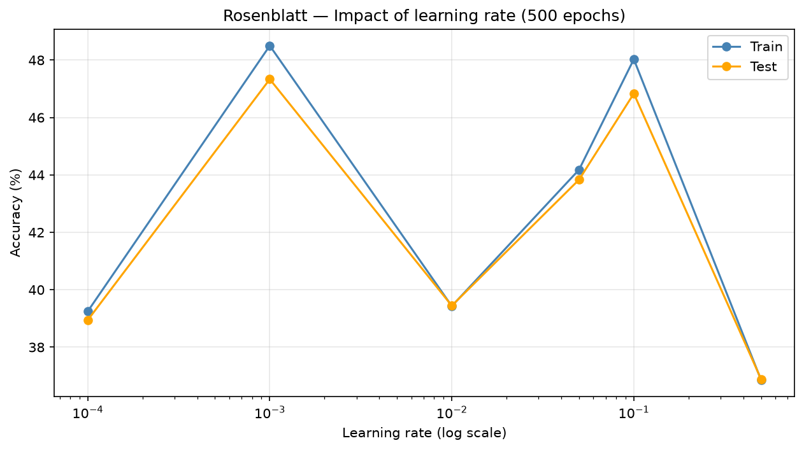
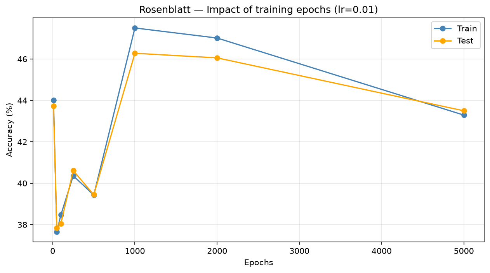
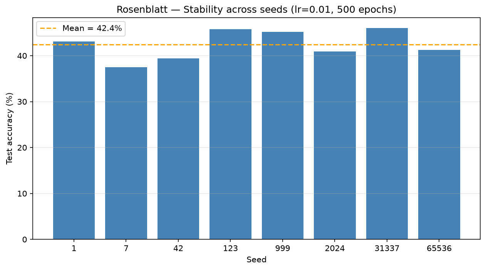
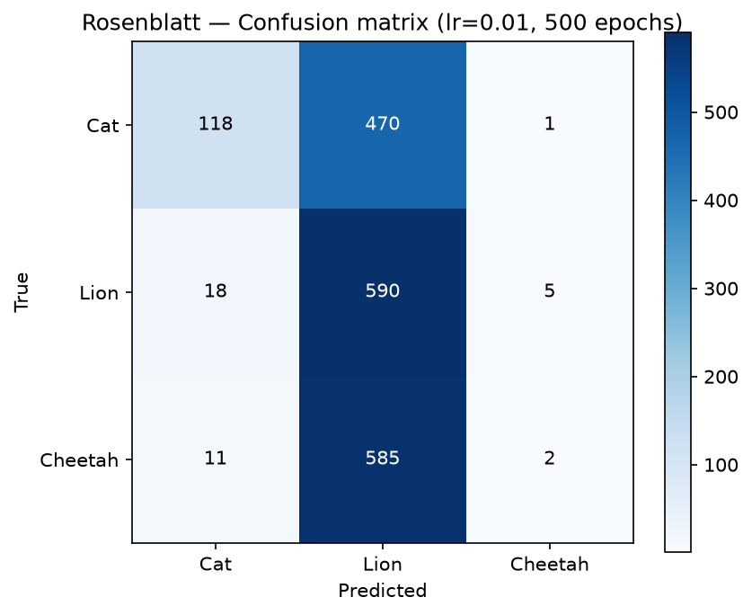

# Étude expérimentale du Perceptron de Rosenblatt

---

## Cadre méthodologique

Le perceptron de Rosenblatt est le modèle linéaire le plus élémentaire de notre projet. Contrairement au MLP qui empile des couches de neurones avec des fonctions d'activation non linéaires, le perceptron ne dispose que d'une seule couche de poids directement connectée aux entrées, sans transformation intermédiaire. La frontière de décision qu'il trace dans l'espace des caractéristiques est donc un hyperplan, ce qui le rend incapable de résoudre des problèmes non linéairement séparables. Pour gérer notre problème à trois classes, nous utilisons une architecture « un contre tous » composée de trois perceptrons indépendants, un pour chaque classe (chat, lion, guépard), chacun apprenant à distinguer sa classe de toutes les autres.

Les résultats présentés ici utilisent la représentation par caractéristiques extraites, un vecteur de vingt dimensions regroupant des statistiques de couleur, un histogramme de luminosité et des mesures de densité de contours. Ce choix de représentation compacte, plutôt qu'un aplatissement brut des pixels, respecte la contrainte que nous nous sommes fixée de ne jamais dépasser un nombre de caractéristiques supérieur à dix pour cent de la taille du jeu d'apprentissage.

Toutes les expériences qui suivent isolent un seul paramètre à la fois, de manière à mettre en évidence son influence propre sur la vitesse de convergence et sur la capacité de généralisation du modèle. Sauf mention contraire, nous utilisons un taux d'apprentissage de 0,01, cinq cents époques et une graine aléatoire fixée. Le découpage entre apprentissage et test suit une répartition de quatre-vingts pour cent contre vingt pour cent.

---

## Expérience 1 — Influence du taux d'apprentissage

Nous avons fait varier le taux d'apprentissage sur six valeurs allant de 0,0001 à 0,5 en maintenant le nombre d'époques fixé à cinq cents. La courbe obtenue présente un profil inhabituel en forme de W, avec deux pics de performance. Le premier pic apparaît autour de 0,001, avec environ quarante-huit pour cent en apprentissage et quarante-sept pour cent en test. La précision chute ensuite à environ trente-neuf pour cent à 0,01, puis remonte à un second pic autour de 0,1 avec des valeurs similaires au premier, avant de s'effondrer à environ trente-sept pour cent à 0,5.

Ce profil non monotone est caractéristique du perceptron simple et s'explique par l'absence de fonction d'activation continue. Contrairement au MLP où un taux trop élevé fait simplement diverger une descente de gradient lisse, le perceptron met à jour ses poids uniquement sur les exemples mal classés, avec des sauts discrets proportionnels au taux d'apprentissage. À certaines valeurs intermédiaires, ces sauts peuvent faire osciller les poids autour de la frontière optimale sans jamais la stabiliser, ce qui explique le creux à 0,01. L'effondrement à 0,5 correspond au régime classique de divergence où les mises à jour deviennent trop brutales pour permettre toute convergence.

---

## Expérience 2 — Influence du nombre d'époques

Nous avons ensuite observé l'évolution des précisions en fonction du nombre d'époques, de dix à cinq mille, à un taux d'apprentissage fixé à 0,01. La courbe suit un schéma en trois phases. Dans la première phase, de dix à cent époques, la précision reste faible autour de trente-huit pour cent, le modèle n'ayant pas encore suffisamment itéré pour ajuster ses frontières. Dans la deuxième phase, entre deux cent cinquante et mille époques, la précision grimpe nettement pour atteindre son maximum autour de mille époques avec environ quarante-sept pour cent en apprentissage et quarante-six pour cent en test.

Au-delà de mille époques, les deux courbes redescendent ensemble vers quarante-trois pour cent à cinq mille époques. Ce comportement diffère de celui du MLP, où le sur-apprentissage se manifestait par une divergence entre les courbes d'apprentissage et de test. Ici, les deux courbes restent proches tout au long de l'entraînement, ce qui est cohérent avec la nature du modèle : un classifieur linéaire possède si peu de paramètres qu'il ne peut pas véritablement mémoriser les exemples d'entraînement. La baisse tardive des performances s'interprète plutôt comme une instabilité des poids, le perceptron continuant à modifier ses frontières sur les exemples qu'il ne parvient pas à classer correctement et dégradant au passage le classement d'autres exemples précédemment bien traités.

---

## Expérience 3 — Stabilité selon la graine aléatoire

Nous avons entraîné le modèle avec huit graines aléatoires différentes en gardant les mêmes hyperparamètres, un taux d'apprentissage de 0,01 et cinq cents époques. La précision de test moyenne s'établit à quarante-deux virgule quatre pour cent, avec des variations allant d'environ trente-sept virgule cinq pour cent pour la graine sept jusqu'à environ quarante-cinq pour cent pour la graine cent vingt-trois. L'écart entre la meilleure et la pire graine atteint donc environ sept points et demi.

Cette variabilité est significative pour un modèle aussi simple et s'explique par le fait que l'initialisation aléatoire des poids détermine le point de départ dans l'espace des solutions. Comme le perceptron ne dispose que de frontières linéaires, un mauvais point de départ peut le conduire vers un hyperplan sous-optimal dont il ne pourra jamais s'extraire, l'algorithme d'apprentissage ne garantissant la convergence que lorsque les données sont linéairement séparables, ce qui n'est pas le cas ici. Ce résultat suggère qu'en pratique, il serait judicieux d'entraîner plusieurs modèles avec des graines différentes et de conserver le meilleur.

---

## Expérience 4 — Matrice de confusion

La matrice de confusion, obtenue avec un taux d'apprentissage de 0,01 et cinq cents époques, révèle un problème majeur. Le modèle prédit la classe lion dans la grande majorité des cas, quelle que soit la vraie classe de l'image. Le lion est correctement reconnu dans environ quatre-vingt-seize pour cent des cas, avec cinq cent quatre-vingt-dix bonnes classifications sur six cent treize. Mais ce chiffre élevé est trompeur, car le chat n'est correctement classé que dans environ vingt pour cent des cas, avec cent dix-huit bonnes classifications contre quatre cent soixante-dix confusions avec le lion. Le guépard est quasiment jamais reconnu, avec seulement deux bonnes classifications sur cinq cent quatre-vingt-dix-huit, la quasi-totalité étant prédite comme lion.

Ce phénomène est celui d'un classifieur qui a convergé vers une solution dégénérée. Le perceptron lion a appris à répondre systématiquement oui, tandis que les perceptrons chat et guépard répondent presque systématiquement non. Cette solution, bien qu'elle paraisse absurde, est localement rationnelle pour un classifieur linéaire : si la classe lion représente un tiers des exemples, prédire toujours lion garantit mécaniquement environ trente-trois pour cent de bonnes réponses sans avoir besoin de distinguer quoi que ce soit. Le fait que la précision globale dépasse légèrement ce seuil, autour de quarante pour cent, indique que le perceptron chat parvient tout de même à intercepter une fraction des chats, mais pas suffisamment pour produire un classifieur équilibré.

Ce résultat constitue la démonstration la plus directe des limites du perceptron simple sur notre problème. Les trois classes de félins ne sont manifestement pas séparables par des hyperplans dans l'espace des vingt caractéristiques extraites, ce qui conduit le modèle vers une solution dégénérée plutôt que vers un compromis équilibré entre les classes. Cette observation contraste avec le MLP, qui atteignait environ soixante-quatre pour cent de précision globale avec une répartition bien plus équilibrée entre les classes, confirmant que la non-linéarité des couches cachées est indispensable pour traiter ce problème de manière satisfaisante.

---

## Synthèse

L'étude du perceptron de Rosenblatt met en lumière les limites fondamentales d'un classifieur purement linéaire sur un problème de classification visuelle. Le profil en W du taux d'apprentissage, l'absence de véritable sur-apprentissage malgré un entraînement prolongé, la sensibilité notable à l'initialisation et surtout l'effondrement vers une solution dégénérée visible dans la matrice de confusion convergent vers la même conclusion : le modèle manque de capacité expressive pour séparer trois classes visuellement proches. Avec une précision de test moyenne d'environ quarante-deux pour cent, le perceptron se situe nettement en deçà du MLP à soixante-quatre pour cent et du RBFN, ce qui est cohérent avec la hiérarchie de complexité entre ces modèles. Ce résultat justifie pleinement le recours à des architectures non linéaires dans la suite du projet, tout en donnant au perceptron le rôle de référence minimale auquel les modèles plus élaborés doivent se comparer.
