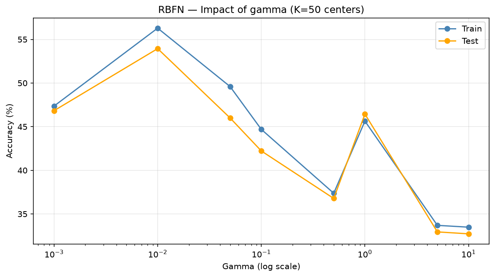
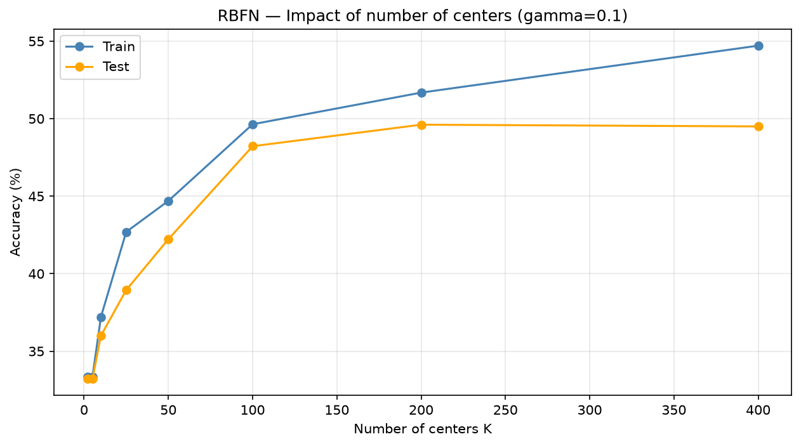
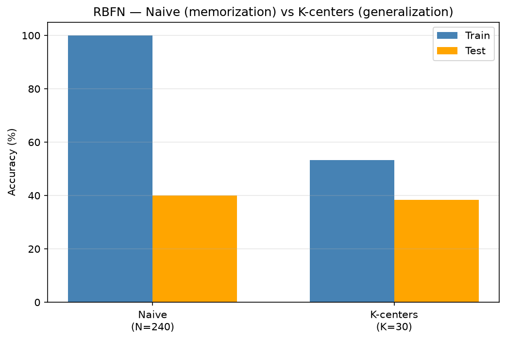
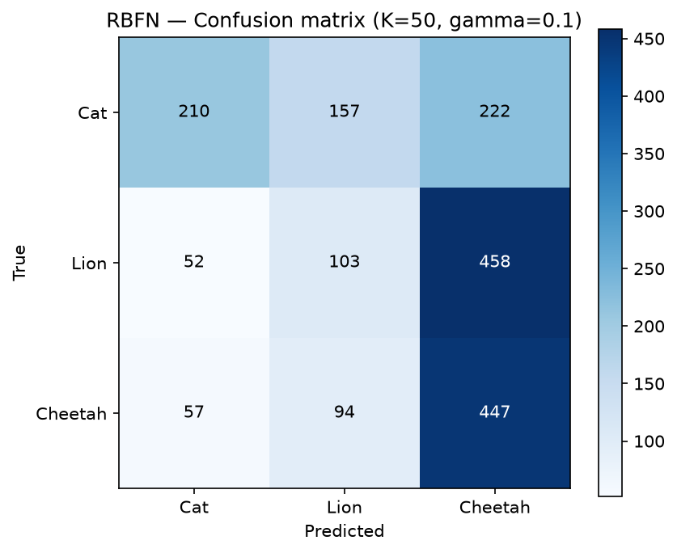

# Étude expérimentale du Radial Basis Function Network

## Cadre méthodologique

Le Radial Basis Function Network repose sur une idée différente de celle du perceptron. Plutôt que d'ajuster progressivement des poids par descente de gradient, il conserve un ensemble de points de référence et attribue à chacun une zone d'influence en forme de cloche gaussienne. L'influence ressentie en un point $X$ par un centre $\mu$ vaut $e^{-\gamma \|X - \mu\|^2}$ : elle vaut un exactement sur le centre et décroît vers zéro à mesure que l'on s'en éloigne. La sortie du réseau est la somme pondérée de toutes ces cloches, et pour la classification nous prenons la classe dont la somme est la plus forte.

Le paramètre gamma contrôle la largeur des cloches. Un gamma élevé produit des pics étroits, où chaque centre n'influence que son voisinage immédiat, tandis qu'un gamma faible produit des dômes larges qui s'étalent sur tout l'espace. Ce paramètre joue donc pour le RBFN le même rôle d'arbitrage entre sur-apprentissage et sous-apprentissage que le nombre d'époques jouait pour le perceptron.

Nous n'utilisons pas la version naïve, qui conserverait chaque exemple comme centre et produirait autant de poids que d'exemples, ce que le cours signale comme un mauvais présage pour la généralisation. Nous élisons à la place un nombre réduit de $K$ centres représentatifs à l'aide de l'algorithme de Lloyd, une méthode de k-means qui répète deux étapes jusqu'à stabilisation : assigner chaque exemple à son centre le plus proche, puis déplacer chaque centre vers la moyenne des exemples qui lui sont assignés. Les poids sont ensuite obtenus en une seule opération par la pseudo-inverse $W = (\Phi^T\Phi)^{-1}\Phi^T Y$, où la matrice $\Phi$ contient l'influence de chaque centre sur chaque exemple. L'entraînement du RBFN n'a donc pas de boucle d'époques : il consiste à trouver les centres puis à résoudre un seul système linéaire.

En haute dimension, la matrice $\Phi^T\Phi$ peut devenir singulière, c'est-à-dire non inversible, car de nombreuses colonnes de $\Phi$ prennent des valeurs presque identiques. Pour garantir l'inversibilité, nous ajoutons un terme de régularisation en ajoutant une petite valeur sur la diagonale avant l'inversion, ce qui revient à résoudre $W = (\Phi^T\Phi + \lambda I)^{-1}\Phi^T Y$. Ce terme minuscule suffit à stabiliser le calcul sans altérer sensiblement la solution.

Les résultats présentés ici utilisent la représentation par pixels bruts, car c'est dans cet espace de grande dimension que les phénomènes décrits en cours apparaissent le plus clairement. La représentation par caractéristiques extraites donne des courbes plus plates, que nous mentionnons en comparaison.

## Expérience 1 — Influence de gamma

Nous avons fait varier gamma sur huit valeurs, de 0,001 à 10, en gardant cinquante centres. La courbe suit cette fois le comportement théorique attendu. La précision atteint son maximum autour de gamma égal à 0,01, avec environ cinquante-six pour cent en apprentissage et cinquante-quatre pour cent en test. Pour les valeurs plus faibles, les cloches sont trop larges et se recouvrent au point que tous les centres se ressemblent, ce qui empêche le réseau de distinguer les régions : c'est du sous-apprentissage. Pour les valeurs plus élevées, la précision décline puis s'effondre jusqu'au seuil aléatoire de trente-trois pour cent à gamma égal à 5 et 10.

Cet effondrement est la signature de la mémorisation extrême : avec des cloches devenues des pics infiniment fins, chaque centre n'a plus d'influence que sur lui-même, si bien qu'un point de test qui ne tombe pas exactement sur un centre ne reçoit aucune influence et ne peut être classé. Il est notable que ce régime d'effondrement n'apparaît que dans l'espace de grande dimension des pixels bruts. Avec les caractéristiques extraites, en dimension vingt, la précision se contentait de monter puis de se stabiliser sans jamais s'effondrer, car les centres y restent toujours assez proches pour que leurs cloches se recouvrent. La dimension de l'espace détermine donc si le régime de sur-apprentissage est seulement atteignable.

## Expérience 2 — Influence du nombre de centres

Nous avons ensuite fait varier le nombre de centres $K$ de deux à quatre cents, à gamma fixé. Avec très peu de centres, le réseau reste au niveau aléatoire, car deux ou cinq cloches ne suffisent pas à couvrir un espace de trois mille dimensions. La précision monte régulièrement à mesure que nous ajoutons des centres, atteignant environ cinquante pour cent en test autour de deux cents centres. Ce besoin d'un grand nombre de centres contraste avec la représentation par caractéristiques extraites, où la précision culminait dès une dizaine de centres : en basse dimension, peu de représentants suffisent à couvrir l'espace, alors qu'en haute dimension il en faut beaucoup plus.

Le début d'un écart entre apprentissage et test apparaît aux valeurs élevées de $K$ : à quatre cents centres, l'apprentissage atteint près de cinquante-cinq pour cent tandis que le test plafonne autour de quarante-neuf pour cent. Cet écart naissant illustre le principe du cours selon lequel augmenter le nombre de paramètres, ici le nombre de centres, finit par nuire à la généralisation.

## Expérience 3 — Version naïve contre K centres

Cette expérience oppose directement les deux approches sur un jeu réduit à cent exemples par classe, la version naïve nécessitant l'inversion d'une matrice dont la taille est celle du nombre d'exemples. Le résultat est la démonstration la plus nette de tout notre travail sur le RBFN. La version naïve, qui garde chaque exemple comme centre, atteint cent pour cent en apprentissage mais seulement quarante pour cent en test. Elle classe donc parfaitement les exemples qu'elle a vus, puisque chacun se trouve exactement sur son propre centre, mais généralise mal.

La version à trente centres obtient quant à elle cinquante-trois pour cent en apprentissage et trente-huit pour cent en test. Elle apprend donc moins bien les exemples d'entraînement, précisément parce qu'elle ne les mémorise pas. Cet écart de soixante points entre l'apprentissage à cent pour cent de la version naïve et sa piètre performance en test est l'illustration parfaite du principe énoncé en conclusion du cours : généraliser n'est pas minimiser l'erreur sur les exemples. Un modèle qui possède autant de paramètres que d'exemples peut toujours mémoriser parfaitement son jeu d'apprentissage, ce qui n'est en rien une garantie de bonne généralisation.

## Expérience 4 — Matrice de confusion

Nous avons enfin examiné la matrice de confusion du réseau à cinquante centres. La précision globale s'établit autour de quarante-deux pour cent, avec une fois encore de fortes disparités entre classes. Dans cette configuration, le guépard devient la classe la mieux reconnue, avec près de soixante-quinze pour cent de bonnes classifications, tandis que le lion devient la plus faible, à environ dix-sept pour cent.

Ce profil d'erreur est particulièrement instructif lorsqu'on le rapproche de nos autres modèles. Le RBFN sur caractéristiques extraites échouait sur le guépard, le perceptron sur pixels bruts échouait sur le lion, et le RBFN sur pixels bruts échoue lui aussi sur le lion tout en réussissant le guépard. Chaque combinaison de modèle et de représentation échoue donc sur une classe différente. Cette observation, cohérente avec ce que nous avions déjà constaté pour le perceptron, confirme que le choix du modèle et de la représentation ne déplace pas seulement la précision globale mais détermine sur quelle classe le système se trompe.

## Synthèse

L'étude du RBFN met en évidence, sur un modèle de nature très différente du perceptron, les mêmes phénomènes fondamentaux. Le paramètre gamma révèle un arbitrage clair entre cloches trop larges qui sous-apprennent et cloches trop étroites qui mémorisent et s'effondrent. Le nombre de centres montre qu'il en faut assez pour couvrir l'espace mais que trop de centres finit par nuire à la généralisation. La comparaison entre version naïve et version à K centres offre la démonstration la plus limpide que mémoriser parfaitement l'apprentissage ne garantit nullement la généralisation. Enfin, la nécessité d'une régularisation pour éviter les matrices singulières en haute dimension constitue une limite pratique importante du modèle, que le cours laisse entrevoir à travers ses avertissements sur le choix de gamma. Comme pour le perceptron, la performance plafonne à un niveau modeste qui tient moins au modèle lui-même qu'à la difficulté de distinguer trois félins visuellement proches, et le profil d'erreur par classe rappelle que représentation et modèle façonnent ensemble ce que le système sait et ne sait pas faire.
