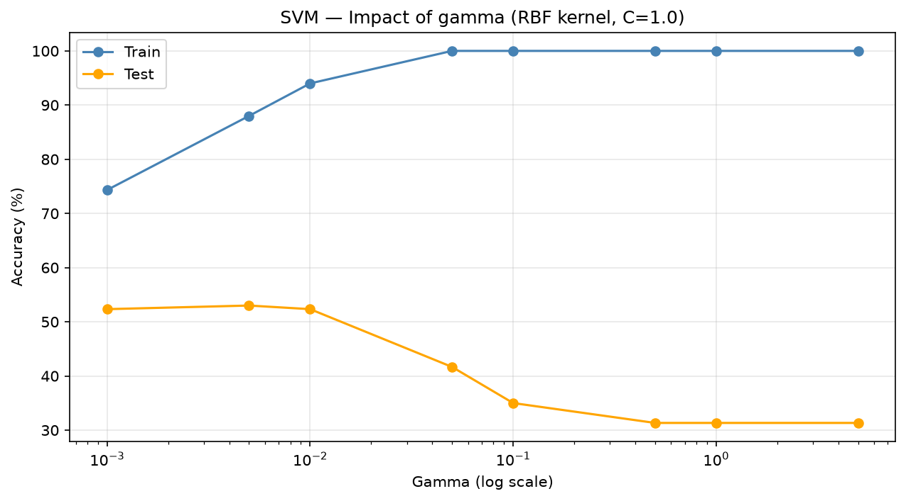
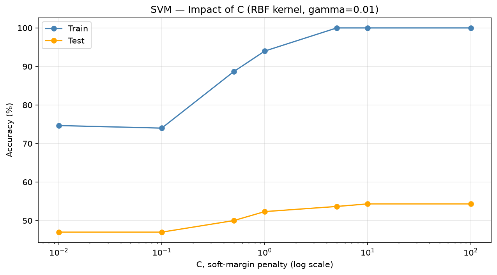
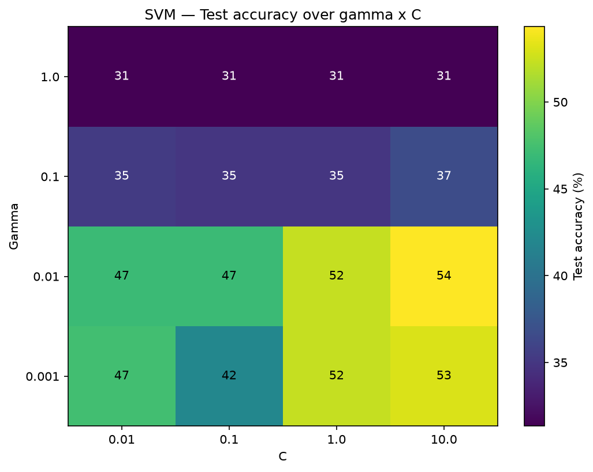
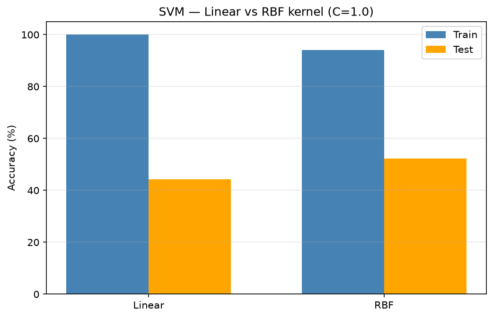
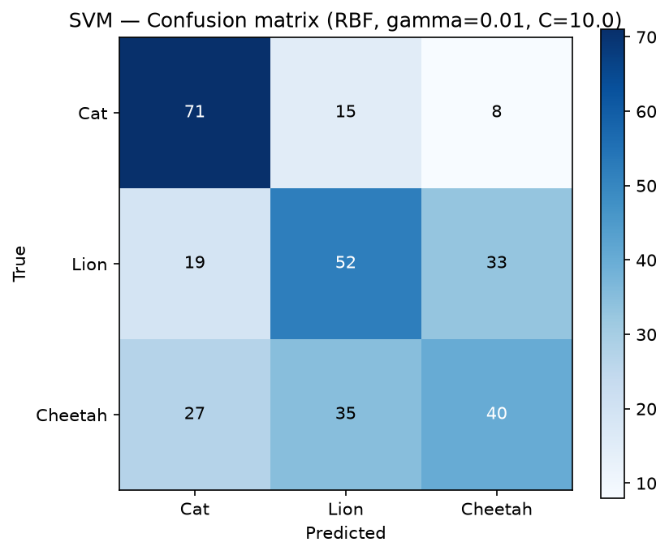

# Étude expérimentale du Support Vector Machine

## Cadre méthodologique

Le Support Vector Machine repose sur une idée différente des modèles précédents : parmi toutes les frontières qui séparent deux classes, il cherche celle dont la marge, c'est-à-dire le couloir vide de part et d'autre de la frontière, est la plus large possible. Cette frontière optimale n'est déterminée que par une poignée de points, ceux qui touchent le bord du couloir, appelés vecteurs supports. Tous les autres points n'ont aucune influence, ce qui fait du SVM un modèle intrinsèquement parcimonieux au sens de la préférence pour la simplicité que le cours défend.

Le SVM étant fondamentalement un classifieur binaire, nous l'appliquons à nos trois classes selon la stratégie un-contre-tous, exactement comme pour le perceptron de Rosenblatt : nous entraînons un classifieur par classe, puis nous retenons pour chaque exemple la classe dont la valeur de décision est la plus élevée. Pour traiter les données non linéairement séparables, nous utilisons l'astuce du noyau, qui remplace le produit scalaire par une fonction de similarité. Nous comparons le noyau linéaire au noyau RBF, ce dernier étant la même gaussienne que celle de notre RBFN.

Deux points pratiques ont guidé l'implémentation. D'abord, la résolution du programme quadratique dual est confiée à la bibliothèque OSQP, qui procède par éclatement d'opérateurs : elle alterne entre une résolution linéaire tenant compte de la contrainte d'égalité et une simple projection qui ramène les coefficients négatifs à zéro, jusqu'à convergence. Ensuite, un SVM à marge dure suppose que les données sont parfaitement séparables, ce qui n'est jamais le cas de données réelles ; nous avons donc ajouté la marge souple, contrôlée par un paramètre C qui borne l'influence maximale de chaque point et autorise ainsi quelques violations de la marge en échange d'une frontière plus lisse.

Les résultats présentés utilisent la représentation par pixels bruts. Comme pour la RBFN, cette représentation en grande dimension n'est pas idéale pour une méthode à noyau, et nous verrons que le SVM y devient extrêmement sensible au choix de gamma. En raison du coût de résolution du programme quadratique, dense et de taille égale au nombre d'exemples pour chacun des trois classifieurs un-contre-tous, nous entraînons le SVM sur un sous-échantillon plus modeste que les autres modèles.

## Expérience 1 — Influence de gamma

Cette expérience produit la courbe de sur-apprentissage la plus nette de tout notre travail. À gamma faible, entre 0,001 et 0,01, le modèle atteint environ soixante-quatorze à quatre-vingt-quatorze pour cent en apprentissage et se maintient autour de cinquante-deux pour cent en test : un modèle exploitable. Mais à mesure que gamma augmente, la précision d'apprentissage grimpe inexorablement jusqu'à cent pour cent, tandis que la précision de test s'effondre : quarante-deux pour cent à gamma égal à 0,05, trente-cinq pour cent à 0,1, puis le plancher de trente et un pour cent, qui correspond à un modèle prédisant systématiquement une seule classe.

Le mécanisme est exactement celui de la mémorisation extrême. Avec des cloches gaussiennes trop étroites en grande dimension, chaque vecteur support n'influence plus que lui-même, si bien que le modèle classe parfaitement ses exemples d'apprentissage mais n'a plus rien à dire sur un point de test. La leçon pratique est claire et constitue le principal enseignement de notre étude du SVM : sur cette représentation, gamma est un paramètre dangereux, dont une valeur à peine trop grande suffit à faire basculer le modèle de l'apprentissage utile à la mémorisation stérile.

## Expérience 2 — Influence de C

Le paramètre C de la marge souple se comporte de façon plus douce que gamma. À gamma fixé à une valeur raisonnable, augmenter C fait monter la précision d'apprentissage vers cent pour cent, tandis que la précision de test progresse d'environ quarante-sept pour cent jusqu'à cinquante-quatre pour cent puis se stabilise. Contrairement à gamma, augmenter C n'entraîne donc pas d'effondrement : parce que le noyau n'est ici pas assez pointu pour mémoriser de façon destructrice, resserrer la marge en augmentant C aide réellement la généralisation jusqu'à un palier.

Ce contraste entre les deux paramètres est instructif. C règle la tolérance aux violations de la marge, un arbitrage relativement stable, alors que gamma règle la forme même de la frontière et peut la rendre arbitrairement contournée. Le comportement observé confirme que, sur nos données, le risque de sur-apprentissage provient bien davantage de gamma que de C.

## Expérience 3 — Interaction gamma et C

Comme les deux paramètres agissent conjointement, nous avons balayé une grille de valeurs et représenté la précision de test sous forme de carte de chaleur. Elle rend l'interaction immédiatement lisible. Toute la bande à gamma élevé, à partir de 0,1, est effondrée entre trente et un et trente-sept pour cent, quelle que soit la valeur de C : une fois gamma trop grand, aucun réglage de C ne peut rattraper la frontière. La performance exploitable vit entièrement dans la bande à gamma faible, où le meilleur compromis se situe à gamma égal à 0,01 et C égal à 10, pour cinquante-quatre virgule trois pour cent en test.

Cette figure résume à elle seule la stratégie de réglage du SVM sur ce problème : choisir d'abord un gamma suffisamment faible pour éviter l'effondrement, puis n'utiliser C que comme un réglage fin.

## Expérience 4 — Noyau linéaire contre noyau RBF

Nous avons comparé les deux noyaux sur les mêmes données. Le noyau RBF l'emporte avec cinquante-deux pour cent en test contre quarante-quatre pour cent pour le noyau linéaire. Le point remarquable est que le noyau linéaire atteint cent pour cent en apprentissage tout en généralisant moins bien : avec trois mille soixante-douze caractéristiques pour seulement quelques centaines d'exemples d'apprentissage, même une frontière linéaire dispose d'assez de liberté pour mémoriser parfaitement le jeu d'apprentissage. Le noyau RBF, avec une frontière plus lisse à gamma faible, généralise mieux malgré une précision d'apprentissage plus basse.

Cette observation illustre concrètement que minimiser l'erreur sur les exemples n'est pas généraliser : le noyau qui apprend le mieux ses exemples n'est pas celui qui se comporte le mieux sur des données nouvelles.

## Expérience 5 — Matrice de confusion

Nous avons enfin examiné la matrice de confusion au meilleur réglage identifié par la carte de chaleur, gamma égal à 0,01 et C égal à 10. La précision globale s'établit à cinquante-quatre virgule trois pour cent, et surtout les trois classes sont désormais réellement prédites, sans l'effondrement vers une seule classe que produisaient les mauvais réglages. Le chat est la classe la mieux reconnue à environ soixante-seize pour cent, le lion se situe à cinquante pour cent, et le guépard reste le plus difficile à trente-neuf pour cent.

Ce profil, où le guépard est la classe la plus faible, rejoint ce que nous avons constaté pour tous nos modèles : la confusion entre lion et guépard demeure la source d'erreur principale, quelle que soit l'approche employée. Le SVM ne fait pas exception à ce constat transversal.

## Synthèse

L'étude du SVM confirme, sur un modèle de nature encore différente, les phénomènes récurrents de tout le projet. Le paramètre gamma révèle un arbitrage brutal entre frontière trop lisse et mémorisation, et se montre bien plus dangereux que le paramètre C de la marge souple, plus stable. Le noyau RBF surpasse le noyau linéaire tout en apprenant moins parfaitement ses exemples, illustration directe de la différence entre apprentissage et généralisation. La nécessité de la marge souple pour traiter des données réelles non séparables constitue une limite pratique importante du modèle idéal des diapositives, et l'extrême sensibilité à gamma sur les pixels bruts montre qu'une méthode à noyau n'est pas la mieux adaptée à une représentation de si grande dimension : une représentation plus compacte, ou une réduction de dimension préalable, servirait mieux ce modèle. Comme pour les autres approches, la performance finale, autour de cinquante-quatre pour cent, se heurte moins aux limites du SVM lui-même qu'à la difficulté intrinsèque de distinguer trois félins visuellement proches, et le profil d'erreur par classe demeure celui de tous nos modèles.
